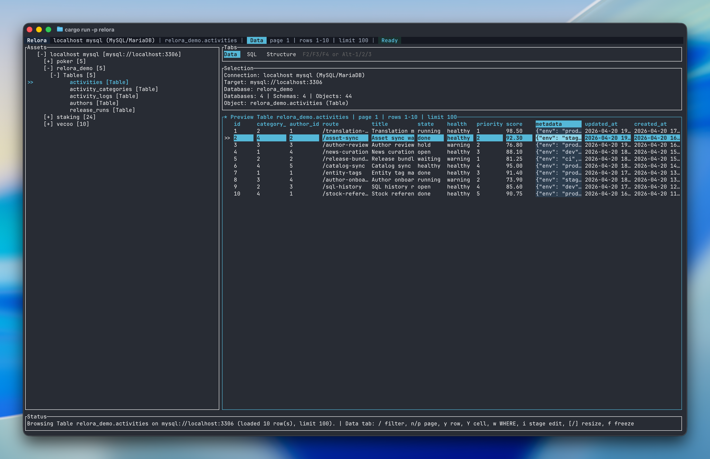

<p align="center">
  
</p>

<p align="center">
  <strong>Keyboard-first terminal database workspace built with Rust and ratatui.</strong>
</p>

<p align="center">
  <a href="https://github.com/murongg/relora/actions/workflows/ci.yml">
    
  </a>
  <a href="https://github.com/murongg/relora/releases">
    
  </a>
  <a href="https://www.npmjs.com/package/relora">
    
  </a>
  <a href="LICENSE">
    
  </a>
  
</p>

<p align="center">
  English | <a href="README.zh-CN.md">简体中文</a>
</p>

<p align="center">
  
</p>

# Relora

Relora is a terminal database workspace for people who want less GUI chrome and more direct control.

It keeps the common loop in one place:

- open one or more saved database connections
- browse databases, schemas, tables, and structure
- preview rows in a dense but keyboard-friendly grid
- edit and execute SQL without leaving the terminal
- stage row edits before committing SQL

## Why Relora

Relora is built for the moments where opening a full GUI client feels heavier than the task itself.

- fast startup
- keyboard-first interaction
- multi-connection browsing in one workspace
- sidecar drivers instead of linking every database client into the main app

## Features

- **Multi-connection workspace**: open and browse one or many saved connections in the same session.
- **Dense data preview**: inspect rows quickly with paging, filtering, copy flows, and row detail.
- **Integrated SQL tab**: write SQL, run the current statement, reuse history, and inspect results.
- **Structure view**: inspect columns and object metadata without leaving the workspace.
- **Staged editing**: preview generated SQL before committing row-level changes.
- **Sidecar drivers**: keep PostgreSQL, MySQL / MariaDB, and SQLite support outside the main TUI binary.

## Install

### npm

```bash
npm install -g relora
relora
```

Or run it once without a global install:

```bash
npx relora
```

### curl

```bash
curl -fsSL https://raw.githubusercontent.com/murongg/relora/main/scripts/install.sh | sh
```

### source

```bash
cargo run -p relora
```

## Quick Start

### 1. Launch the workspace

```bash
relora
```

Or open a connection directly:

```bash
relora --url postgresql://localhost:5432/postgres
```

### 2. Add a saved connection

From the launcher:

- `a` creates a connection
- `e` edits the selected connection
- `t` tests the selected connection
- `Enter` launches the selected connection

Saved connections live at:

```text
~/.config/relora/connections.json
```

### 3. Work inside the workspace

- use the left asset tree to select a database object
- use `F2`, `F3`, `F4` or `Alt-1`, `Alt-2`, `Alt-3` to switch `Data`, `SQL`, and `Structure`
- use `/` to filter preview rows
- use `F5` or `Ctrl-Enter` to run the current SQL statement
- use `i` to stage a cell edit from the data grid

## Supported Databases

Relora currently supports:

- PostgreSQL
- MySQL / MariaDB
- SQLite

Database support is shipped through sidecar binaries:

- `relora-driver-postgres`
- `relora-driver-mysql`
- `relora-driver-sqlite`

## What You Get

- multi-connection launcher
- `Data`, `SQL`, and `Structure` tabs in one terminal view
- SQL history, autocomplete, and statement-aware execution
- row preview, copy flows, and quick filters
- PostgreSQL `EXPLAIN` and `EXPLAIN ANALYZE`
- staged CRUD with SQL preview before commit

## Keybindings

### Launcher

| Key | Action |
| --- | --- |
| `j` / `k` | Move between saved connections |
| `Space` | Mark or unmark a connection for multi-launch |
| `a` | Create a connection |
| `e` | Edit the selected connection |
| `d` | Delete the selected connection |
| `t` | Test the selected connection |
| `Enter` | Launch the selected connection |
| `q` / `Esc` | Quit or cancel |

### Global

| Key | Action |
| --- | --- |
| `Tab` / `Shift-Tab` | Rotate focus between panes |
| `F2` or `Alt-1` | Open `Data` |
| `F3` or `Alt-2` | Open `SQL` |
| `F4` or `Alt-3` | Open `Structure` |
| `Ctrl-P` | Open command palette |
| `F10` or `Ctrl-R` | Open SQL history |

### Assets and Browser

| Key | Action |
| --- | --- |
| `j` / `k` | Move selection |
| `h` / `l` | Collapse or expand |
| `Enter` / `Space` | Toggle the selected node |
| `/` | Open data filter |
| `e` | Open SQL editor |
| `s` / `i` / `u` / `d` | Insert `SELECT` / `INSERT` / `UPDATE` / `DELETE` templates |
| `r` | Refresh current selection |
| `c` | Cancel running tasks |
| `q` / `Esc` | Quit workspace or return focus |

### Data Grid

| Key | Action |
| --- | --- |
| `j` / `k` | Move rows |
| `h` / `l` | Move columns |
| `Enter` | Open row inspector |
| `/` | Filter current preview |
| `n` / `p` | Next or previous preview page |
| `y` / `Y` | Copy row or cell |
| `w` | Copy generated `WHERE` clause |
| `i` | Stage a cell edit |
| `[` / `]` / `=` | Shrink, expand, or reset column width |
| `f` / `F` | Freeze columns or clear frozen columns |

### SQL Editor

| Key | Action |
| --- | --- |
| `Ctrl-Enter` or `F5` | Execute the current statement |
| `Ctrl-T` | New SQL tab |
| `Ctrl-W` | Close SQL tab |
| `F6` / `F7` | Previous or next SQL tab |
| `F8` / `F9` | Previous or next result set |
| `F10` or `Ctrl-R` | Open SQL history |
| `F11` / `F12` | `EXPLAIN` / `EXPLAIN ANALYZE` |
| `Ctrl-G` | Commit staged CRUD |

### Row Inspector

| Key | Action |
| --- | --- |
| `Tab` | Switch between inspector panes |
| `j` / `k` | Move or scroll |
| `PgUp` / `PgDn` | Page the preview |
| `Ctrl-U` / `Ctrl-D` | Scroll faster |
| `y` / `Y` | Copy the current value |
| `i` | Start editing from the current field |
| `f` | Toggle raw or formatted display |
| `q` / `Esc` | Close inspector |
